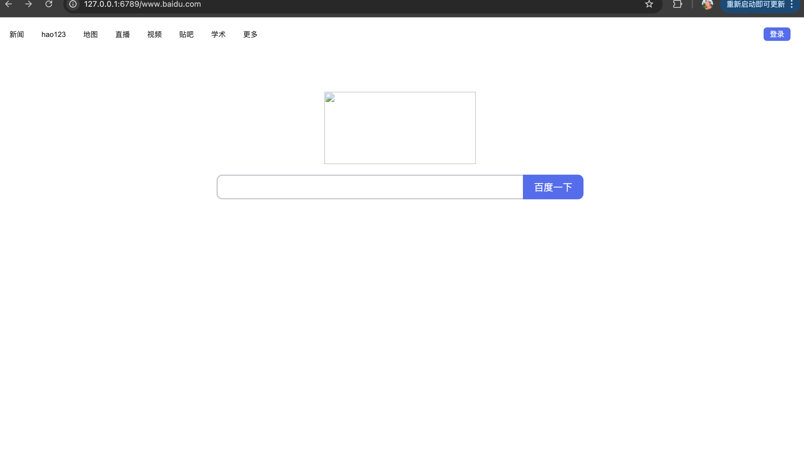
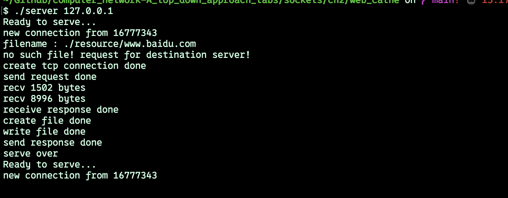

# web catch 

理解题目意思错了，但是最后也差不多完成缓存的功能。

题目是通过设置代理，将网络请求发送到代理服务器，然后由代理服务器响应。

但是我按照文档给出的http://localhost:8888/www.google.com 的形式，将该形式的url发送给了代理服务器，然后代理服务器从本地文件将缓存信息返回，没有就由代理服务器发送给目的服务器http请求，再缓存http响应，再将缓存信息发送给浏览器

### 效果：

- 浏览器效果(以www.baidu.com为例，实际上这样更加复杂，这里的处理就从简了)

- 代理服务器效果

