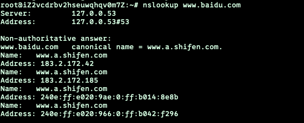
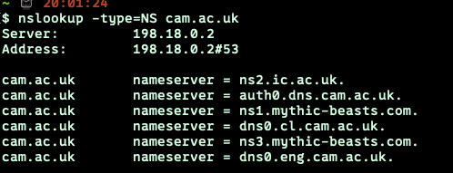
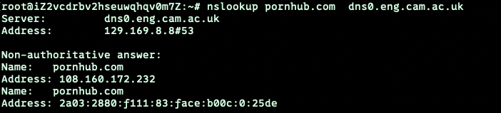
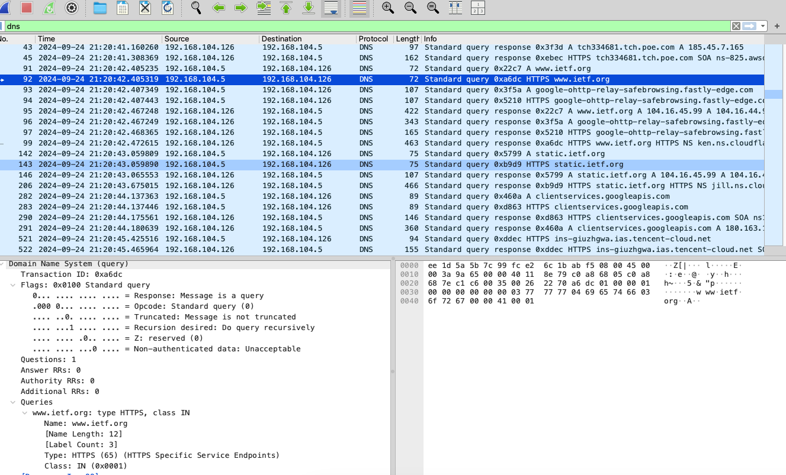
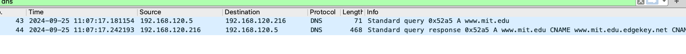
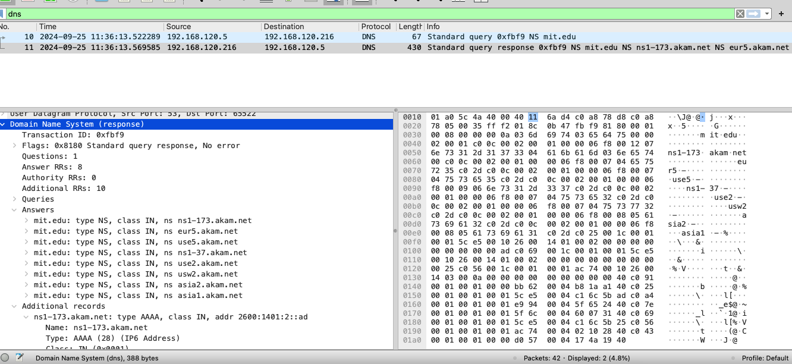
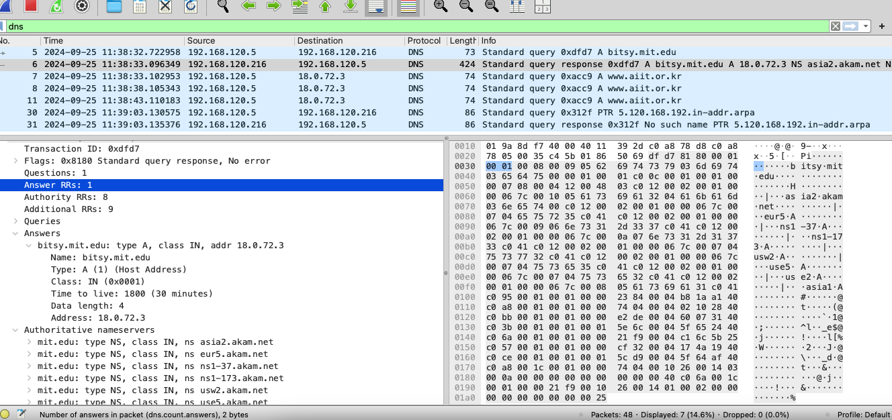

# wireshark : dns 

### 1.nslookup:

执行以下操作（并记下结果）：

1. 运行*nslookup*以获取一个亚洲的Web服务器的IP地址。该服务器的IP地址是什么？

> (以百度为例)

2. 运行*nslookup*来确定一个欧洲的大学的权威DNS服务器。

> 以剑桥大学为例

3. 运行*nslookup*，使用问题2中一个已获得的DNS服务器，来查询Yahoo!邮箱的邮件服务器。它的IP地址是什么？

> 每个权威dns服务器都不显示拒绝，所以查询其他的服务器ip

### 2.了解ifconfig/ipconfig
略
### 3.使用wireshark追踪dns
效果：

4. 找到DNS查询和响应消息。它们是否通过UDP或TCP发送？
> 通过 UDP发送
5. DNS查询消息的目标端口是什么？ DNS响应消息的源端口是什么？
> 都是53，可从udp首部看出,
6. DNS查询消息发送到哪个IP地址？使用ipconfig来确定本地DNS服务器的IP地址。这两个IP地址是否相同？
> 发送到192.168.104.126, 再使用nslookup可以发现本地dns服务器ip与该ip相同
7. 检查DNS查询消息。DNS查询是什么"Type"的？查询消息是否包含任何"answers"？
> type A,不包含answers
8. 检查DNS响应消息。提供了多少个"answers"？这些答案具体包含什么？
> 2个, 主机别名，ip，等

9. 考虑从您主机发送的后续TCP SYN数据包。 SYN数据包的目的IP地址是否与DNS响应消息中提供的任何IP地址相对应？
> 是
10. 这个网页包含一些图片。在获取每个图片前，您的主机是否都发出了新的DNS查询？
> 部分是的

### 捕获nslookup
##### `nslookup  www.mit.edu`

11. DNS查询消息的目标端口是什么？ DNS响应消息的源端口是什么？
> 都是53
12. DNS查询消息的目标IP地址是什么？这是你的默认本地DNS服务器的IP地址吗？
> 192.168.120.216，是的
13. 检查DNS查询消息。DNS查询是什么"Type"的？查询消息是否包含任何"answers"？
> A ,不包含
14. 检查DNS响应消息。提供了多少个"answers"？这些答案包含什么？
> 3个,别名，ip，type，ttl，datalength,CNAME
15. 提供屏幕截图。

##### `nslookup -type=NS mit.edu`

16. DNS查询消息发送到的IP地址是什么？这是您的默认本地DNS服务器的IP地址吗？
> 是的
17. 检查DNS查询消息。DNS查询是什么"Type"的？查询消息是否包含任何"answers"？
> NS，无answers
18. 检查DNS响应消息。响应消息提供的MIT域名服务器是什么？此响应消息还提供了MIT域名服务器的IP地址吗？
> 很多，如下图所示，不包含ip
19. 提供屏幕截图。

##### `nslookup www.aiit.or.kr bitsy.mit.edu`

20. DNS查询消息发送到的IP地址是什么？这是您的默认本地DNS服务器的IP地址吗？如果不是，这个IP地址是什么？
> 第一个dns查询消息的ip地址是我的默认本地dns服务器，查询到bitsy.mit.edu的ip地址为18.0.72.3。然后向该ip地址发送新的dns查询消息，但是好像该dns服务器已停用，所以失败了。
21. 检查DNS查询消息。DNS查询是什么"Type"的？查询消息是否包含任何"answers"？
> A type , 不包含
22. 检查DNS响应消息。提供了多少个"answers"？这些答案包含什么？
> 第一个向默认本地dns服务器返回的响应包含bitsy.mit.edu的1个answer , 后续向该dns服务器发送的查询信息都没有响应，所以没有answer
23. 提供屏幕截图。

### easy...