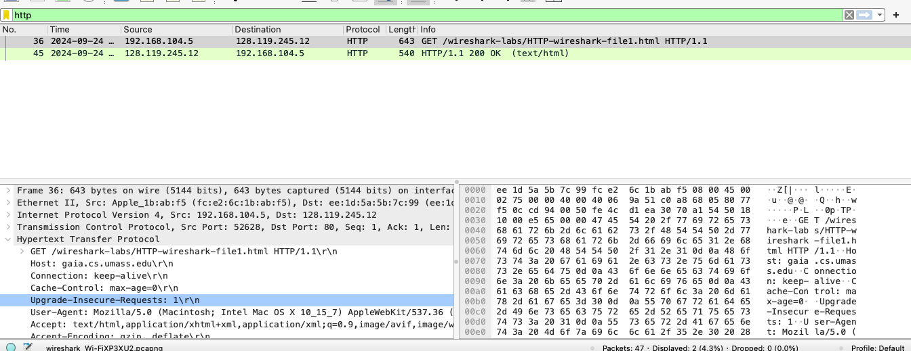
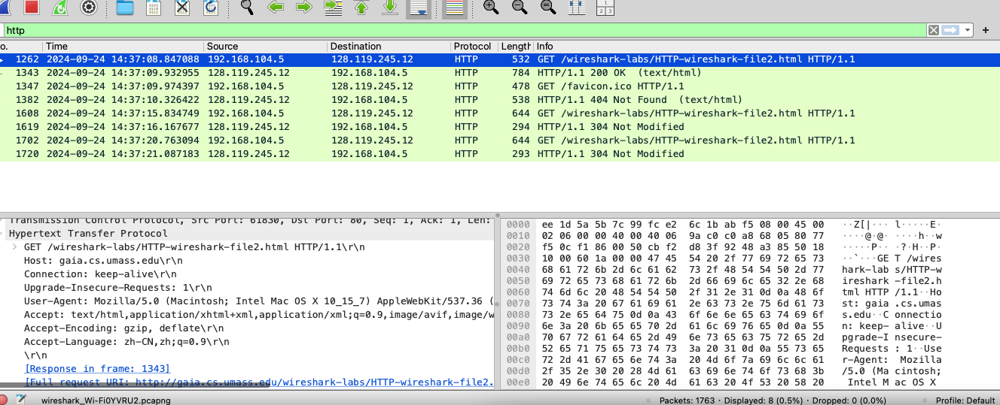
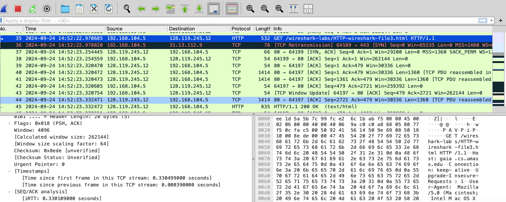
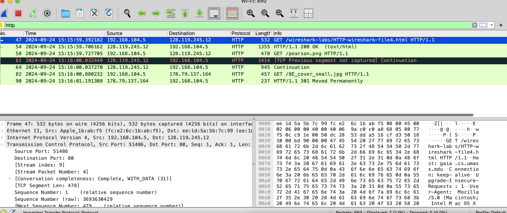
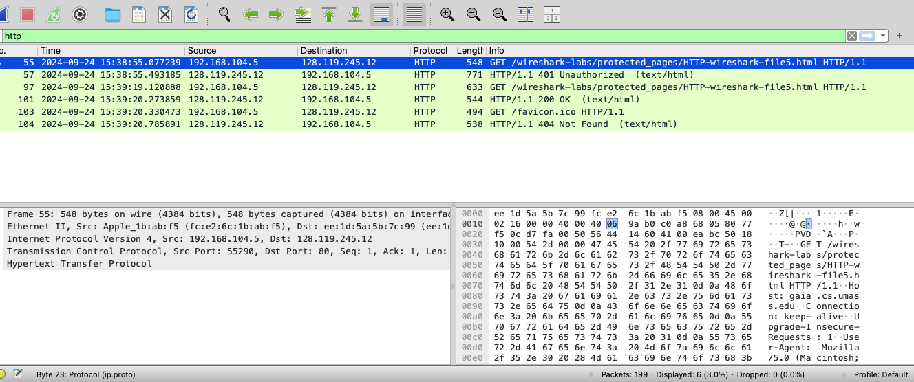

# wireShark : http

### 1.基本交互
效果：

回答问题：

1. 您的浏览器是否运行HTTP版本1.0或1.1？服务器运行什么版本的HTTP？
- 浏览器运行http1.1 , 服务器运行http/1.1
2. 您的浏览器会从接服务器接受哪种语言（如果有的话）？
- zh-CN,zj
3. 您的计算机的IP地址是什么？ gaia.cs.umass.edu服务器地址呢？
- 192.168.104.5 
- 128.119.245.12
4. 服务器返回到浏览器的状态代码是什么？
- 200
5. 服务器上HTML文件的最近一次修改是什么时候？
- Tue , 24 Sep 2024 05:57:01 GMT
6. 服务器返回多少字节的内容到您的浏览器？
- 128
7. 通过检查数据包内容窗口中的原始数据，你是否看到有协议头在数据包列表窗口中未显示？ 如果是，请举一个例子。
- 没有啊

### 2.条件交互
效果：

回答问题：

8. 检查第一个从您浏览器到服务器的HTTP GET请求的内容。您在HTTP GET中看到了“IF-MODIFIED-SINCE”行吗？
- 没有
9. 检查服务器响应的内容。服务器是否显式返回文件的内容？ 你是怎么知道的？
- 应该是吧，data显示了html文件
10. 现在，检查第二个HTTP GET请求的内容。 您在HTTP GET中看到了“IF-MODIFIED-SINCE:”行吗？ 如果是，“IF-MODIFIED-SINCE:”头后面包含哪些信息？
- 有，包含了"Tue , 24 Sep 2024 05:59:02 GMT\r\n"
1.  针对第二个HTTP GET，从服务器响应的HTTP状态码和短语是什么？服务器是否明确地返回文件的内容？请解释。
- 304 Not Modified ,没有，没有data了

### 3.检索长文件
效果：

回答问题：

12. 您的浏览器发送多少HTTP GET请求消息？哪个数据包包含了美国权利法案的消息？
- 1个，三个长度为1414的tcp数据包和最后长度为835的http报j
13. 哪个数据包包含响应HTTP GET请求的状态码和短语？
- 第一个长度为1414的tcp数据包
14. 响应中的状态码和短语是什么？
- 200 OK
15. 需要多少包含数据的TCP段来执行单个HTTP响应和权利法案文本？
- 4个

### 具有嵌入对象的html文件
效果：

回答问题：

16. 您的浏览器发送了几个HTTP GET请求消息？ 这些GET请求发送到哪个IP地址？
- 3个, 前两个都是128.119.245.12 , 后一个是178.79.137.164
17. 浏览器从两个网站串行还是并行下载了两张图片？请说明。
- 串行下载，因为每对请求和响应都是有时间差的，所以是顺序请求响应的

### http认证
效果：

回答问题：

18. 对于您的浏览器的初始HTTP GET消息，服务器响应（状态码和短语）是什么响应？
- 401 Unauthorized
19. 当您的浏览器第二次发送HTTP GET消息时，HTTP GET消息中包含哪些新字段？
- Cathe-Control和Authorization

### easy...

