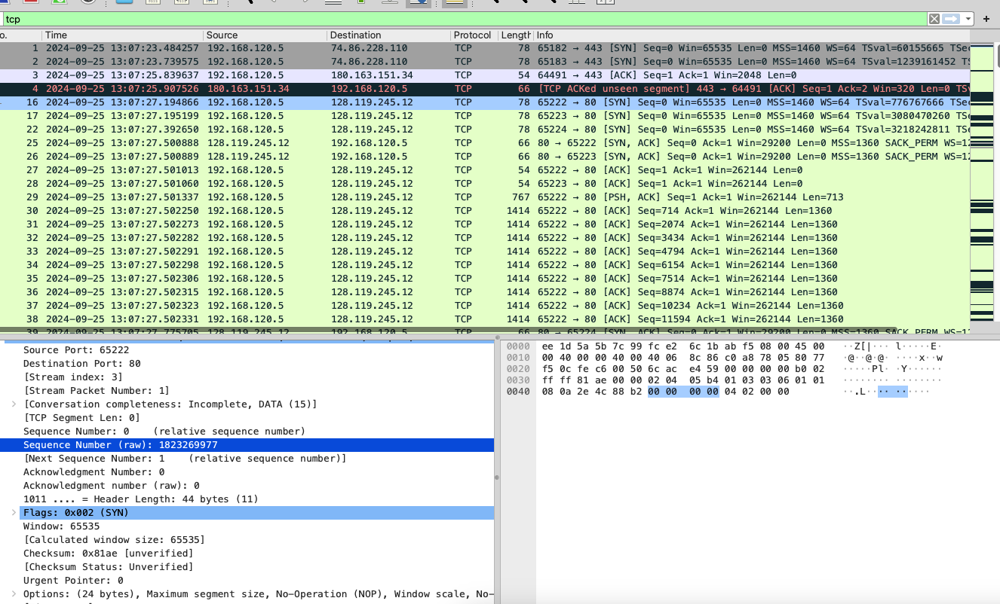
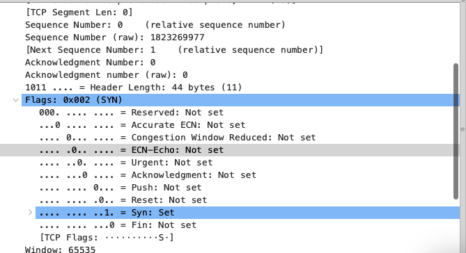
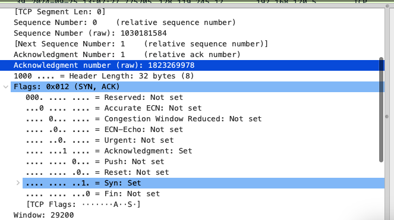
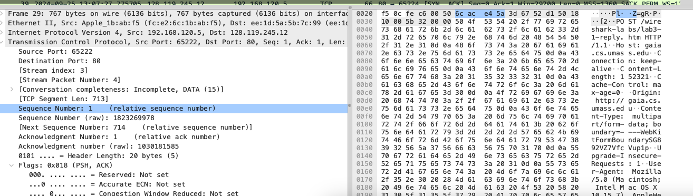
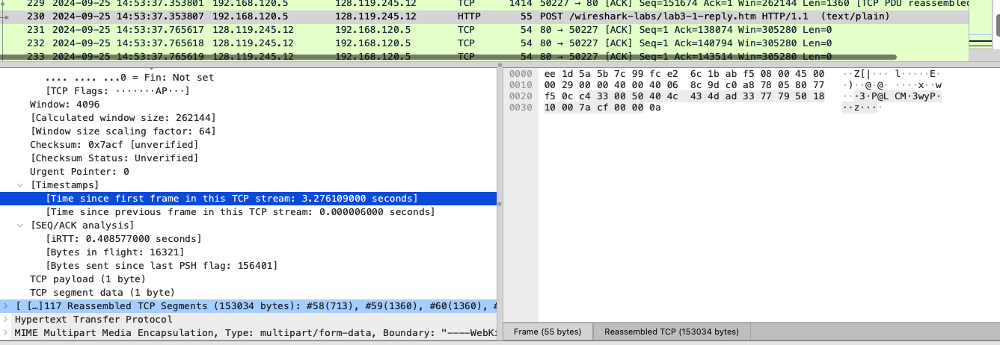

# wireshark : tcp
### 效果：

### 回答问题:
1.将文件传输到 gaia.cs.umass.edu 的客户端计算机(源)使用的 IP 地址和 TCP 端口号是什么? 要回答这个问题，最简单的方法是使用“所选数据包 标头的详细信息”视窗，选择 HTTP 讯息并探索用于携带此 HTTP 讯息的 TCP 数据包的详细信息(如果你不确定是哪一个 Wireshark 视窗。请参阅 “Getting Started with Wireshark”实验中的图 2 )
> ip:192.168.120.5，端口为65222

2.gaia.cs.umass.edu 的 IP 地址是什么? 在哪个端口号上发送和接收此连接的 TCP 区段?
> 128.119.245.12 , 80端口

3.客户端计算机(源)将文件传输到 gaia.cs.umass.edu 所使用的 IP 地址和 TCP 端口号是多少?
> ip:192.168.120.5，端口为65222

4.用于在客户端计算机和 gaia.cs.umass.edu 之间启动 TCP 连接的 TCP SYN 区
段的序列号是什么? 将区段标识为 SYN 区段的区段有什么功能?

> 序列号为0，flags中SYN位置为1。标识这是用于建立tcp连接的tcp报文段

5.gaia.cs.umass.edu 发送给客户端计算机以回复 SYN 的 SYNACK 区段的序列 号是多少? SYNACK 区段中的 Acknowledgment 栏位的值是多少? Gaia.cs.umass.edu 是如何确定此 Acknowledgment 的数值的? 在将区段标识 为 SYNACK 区段的区段在连线中有什么功能?

> 序列号为0。Acknowledgment为1。规定为SYN报文段段序列号+1。用于对SYN报文段的确认，让客户端继续进行tcp的连接

6.包含 HTTP POST 命令的 TCP 区段的序列号是多少? 请注意，为了找到 POST 命令，您需要深入了解 Wireshark 窗口底部的数据包内容􏰁段，在其 DATA 栏位中查找带有“POST”的区段。

> 序列号为1

7.将包含 HTTP POST 的 TCP 区段视为 TCP 连接中的第一个区段。
在这个 TCP 连线中前六个 TCP 区段的序列号是什么(包括包含 HTTP POST 的 段)? 
每区段发送的时间是什么时候? 
收到的每个区段的 ACK 是什么时 候?
鉴于发送每个 TCP 区段的时间与收到确认的时间之间的差异，六个区 段中每个区段的 RTT 值是多少? 
收到每个 ACK 后，EstimatedRTT 值(参 见本节中的第 3.5.3 节，第 242 页)是什么? 
假设第一个 EstimatedRTT 的 值等于第一个区段的测量 RTT，然后使用课本第 242 页的 EstimatedRTT 公式计算所有后续区段。(译注:中译本的页数可能不同)

> 1,714,2074,3434,4794,6154
> 13:07:27.501337 13:07:27.502250 13:07:27.502273 13:07:27.502282 13:07:27.502291 13:07:27.502298
> 13:07:24.828697，但是之后其他的几个确认报文段却没抓取到，(是因为累计确认的原因吗？)
> 剩余略

8.前六个 TCP 区段的长度是多少?
> 第一个是713，其他是1360

9.对于整个跟踪包，收到的最小可用缓冲区空间量是多少? 缺少接收器缓冲 区空间是否会限制发送方传送 TCP 区段?
> 我作为接收方的最小缓冲区为261312，服务器作为接收方的最小缓冲区为30720。会限制

10.在跟踪文件中是否有重传的区段? 为了回答这个问题，您检查了什么(在 跟踪包中)?
> 发送方未看到重传报文段，但是抓取到了接收方发送的冗余ACK报文段

11.接收器通常在 ACK 中确认多少数据? 您是否可以识别接收方每隔一个接收 到的区段才发送确认的情况(参见本文第 250 页的表 3.2)。
> 第一个是713，第二个是12240，第三个是1360，第四个是2720...,不能，隔的报文段个数不确定

12.TCP 连接的吞吐量(每单位时间传输的􏰁节数)是多少? 解释你如何计算 这个值。

> 吞吐量= 数据传输大小 / 传输时间
> 通过分析结束的http报文，可以获得从第一帧发送的总时间和总的数据大小:
> t = 3.276109000s , data = 153034 bytes
> 吞吐量 = 45.617305 kb/s

### over:
`interesting...`