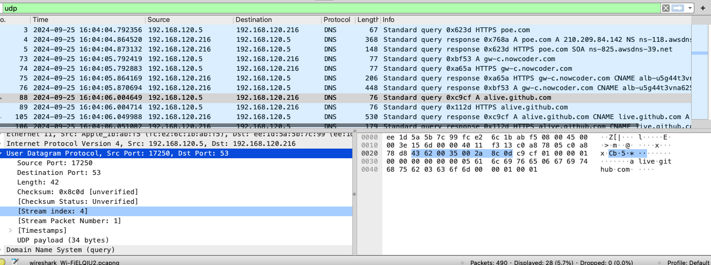

# wireshark : udp

### 效果：

1.从跟踪中选择一个 UDP 数据包。 从此数据包中，确定 UDP 标头中有多少 字段。 (建议不要查看课本，直接根据您的数据包跟踪结果回答)，并为 这些字段命名。
> source port , destination port , length , checksum 

2.通过查询 Wireshark 的数据包内容字段中显示的信息，确定每个 UDP 报头 字段的长度(以字节为单位)。
> 首部长8字节，每个字段占2字节

3.长度字段中的值是指的是什么?(此问题您可以参考课本)。 使用捕获的 UDP 数据包验证您的声明。
> 整个udp报文段，包括udp首部和udp负载

4. UDP 有效负载中可包含的最大字节数是多少? (提示:这个问题的答案 可以通过你对上述 2 的回答来确定)
> length长度为2字节，最大可表示为65535 - 8 = 65527字节

5. 最大可能的源端口号是多少? (提示:见 4 中的提示)
> 65535 ,(2^16 - 1)

6.UDP 的协议号是什么? 以十六进制和十进制表示法给出答案。 要回答这个 问题，您需要查看包含此 UDP 段的 IP 数据报的 Protocol 字段(参见书中的 图 4.13 和 IP 头字段的讨论)。
> 十进制：17；十六进制：0x11；

7.观察发送 UDP 数据包后接收响应的 UDP 数据包，这是对发送的 UDP 数 据包的回复，请描述两个数据包中端口号之间的关系。(提示:对于响应 UDP 目的地应该为发送 UDP 包的地址)
> 响应udp报文段的目的端口是请求udp报文段的源端口，响应ud报文段的源端口是请求udp报文段的目的端口