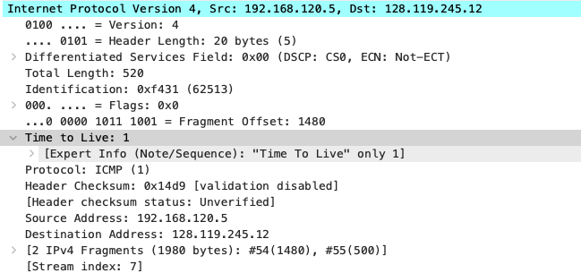
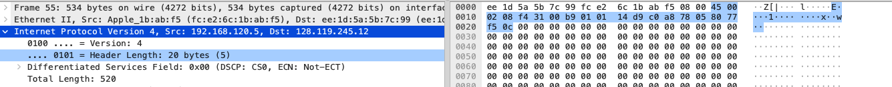
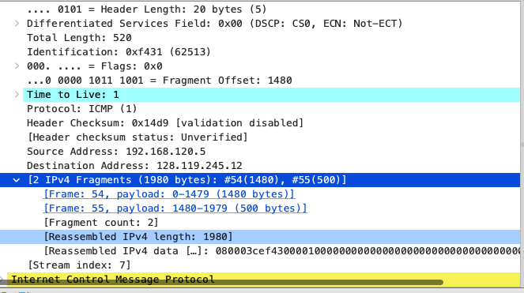
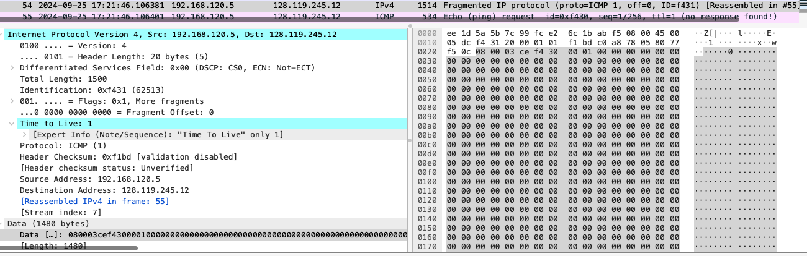
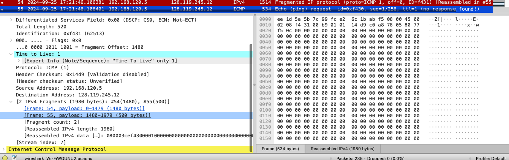
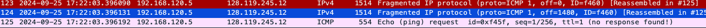

# wireshark : ip

### 回答问题：

1.选择计算器发送的第一个 ICMP Echo Request 消息，然后在 packet details window 中展开数 据包的 Internet 协议部分。您的计算器的 IP 地址是多少?

> 192.168.120.5

2.在 IP header 中，上层协议字段的值是多少?

> 1

3.IP header 有多少 bytes? IP datagram 的有效负载中有多少 bytes? 说明如何 确定 payload bytes 的数。

> 20bytes 

> 1980bytes,(这里如果是按题目的发送56byte，那么不会分片，但是我这里是发送的2000，所以分片了,然后除去20byte的ip首部)

4.此 IP 数据报是否已被分段(fragmented)?解释您如何确定数据报是否已被分 段(fragmented)。
>是的,如上图显示ip分片，分成了两个片(若此时按题目要求56byte，则不会分片)

5.在您的计算器发送的这一系列 ICMP 消息中，IP 数据报中的哪些字段 总是有改变?
> Identification,checksum,ttl

6.哪些字段保持不变? 哪个字段必须保持不变? 哪些字段必须更改? 为什 么?
> 保持不变：version,header length,differentiated servers field ,total length,flags,fragment offset,protocol , source address, destination address
> 必须保持不变：version , protocol，header length,differentiated servers field 
> 必须改变：Identification(确定icmp的唯一性),checksum(保证每个icmp数据报都是正确的),ttl(),data

7.描述您在 IP datagram 的 Identification field 中的值中所看到的
> 在目前source的排序下，从上到下逐个-1

8.ID 字段和 TTL 字段的值是多少?
> ID:46838 , TTL:64

9.对于最近(第一跳)路由器发送到您的计算器的所有 ICMP TTL 超出的回 复，这些值是否保持不变?为什么?
>是保持不变，因为距离我的计算机的路由器跳数固定，ttl的变化与路由器跳数有关

10.在将 pingplotter 中的数据包大小更改为 2000 后，查找计算机发送的第一个 ICMP Echo Request 消息。该消息是否已碎片化为多个 IP 数据报? [注意: 如果你发现你的数据包没有被分割，你应该下载 zip 文件 http://gaia.cs.umass.edu/wireshark-labs/wireshark-traces.zip 并提取 ip-ethereal- trace-1packet 跟踪。 如果您的计算机具有以太网接口，则数据包大小为 2000 会导致碎片。]
> 是的，分成了两个片

11.打印出碎片 IP 数据报的第一个片段。 IP 头中的哪些信息表明数据报已碎片 化? IP 头中的哪些信息表明这是第一个片段还是后一个片段? 这个 IP 数 据报有多长?

> 从ip header flags中可以看到Don't fragment未set，说明分片，more fragment 已经set，说明还有分片，则该分片不是最后一个分片，下一行的Fragment Offset = 0 表示是第一个分片
> 所以可以确认该ip数据报是第一个分片,长度是1514(1480 + 20 + 14)

12.打印出碎片 IP 数据报的第二个片段。 IP 标头中的哪些信息表明这不是第一 个数据报片段? 是否还有更多的片段? 你是如何知道的?

>从ip header flags可以看到Don't fragment 和more fragment 都未set，说明是最后一个分片,且fragment offset为1480，为上一个分片的后面，所以肯定不是第一个分片

13.在第一个和第二个片段中，IP 标头中哪些字段发生了变化?
> totol length,flags,fragment offset,header checksum

14.从原始数据报创建了多少个片段?

> 3个

15.片段中 IP 标头中的哪些字段发生了变化?
> totol length , flags , fragment offset , header checksum 