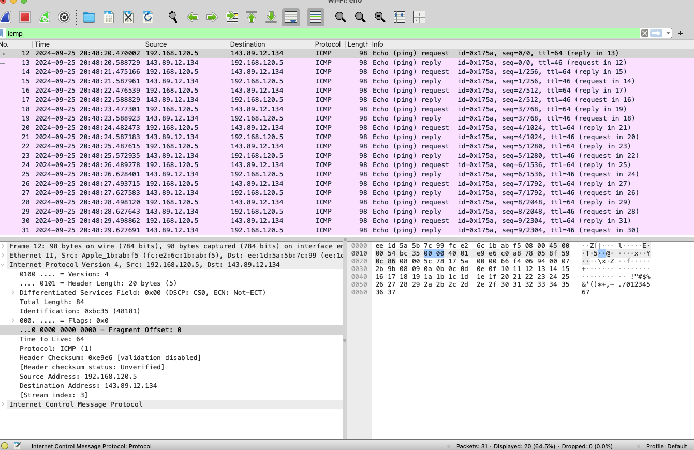
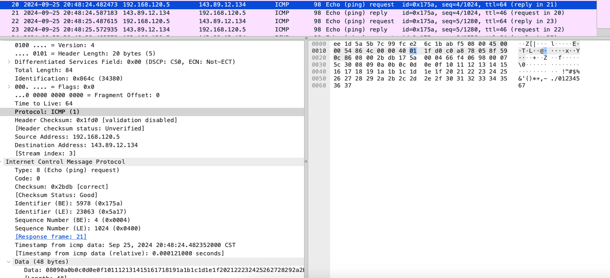
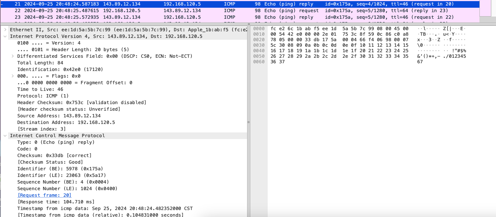
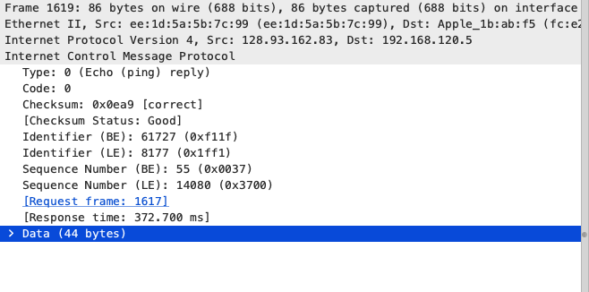
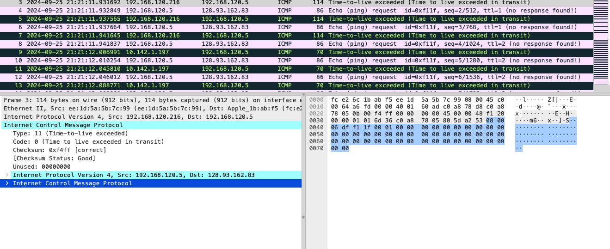
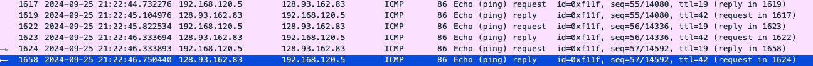

# wireshark : icmp

### ping:

效果:

回答问题:

1.您的主机的 IP 地址是多少? 目标主机的 IP 地址是多少?
> 我的主机ip：192.168.120.5,目标主机ip：143.89.12.134

2.为什么 ICMP 数据包没有源端口号和目的端口号?
> 因为icmp协议是网络层协议，是端到端的协议，不需要端口

3.查看任意的请求 ICMP 数据包， ICMP 类型和代码是什么? 该 ICMP 数据包还有哪些其他字段? 校验和，序列号和标识符字段有多少字节?

> type为8，code为0。还有checksum , Identifier，Sequence number,timestamp。
> checksum 2 字节, sequence number 2字节 ， identifier 2字节

4.查看任意的响应 ICMP 数据包， ICMP 类型和代码是什么? 该 ICMP 数据包还有哪些其他字段? 校验和，序列号和标识符字段有多少字节?

> type为0，code为0，还有checksum , Identifier, Sequence number ,Timestamp。
> checksum 2 字节, sequence number 2字节 ， identifier 2字节
 
### traceroute:
效果:

![4]

回答问题：

5.您的主机的 IP 地址是多少? 目标目标主机的 IP 地址是多少?
> 我的主机ip：192.168.120.5,目标主机ip：128.93.162.83

6.如果 ICMP 发送了 UDP 数据包(如在 Unix / Linux 中)，那么探测数据包的 IP 协议号仍然是 01 吗? 如果没有，它会是什么?
> 不是，将会变成17(udp)

7.检查屏幕截图中的 ICMP 响应数据包。 这与本实验的前半部分中的 ICMP ping 查询数据包不同吗? 如果不同，请解释为什么?

> type为0，表示为回显响应数据报,以及checksum ,identifier，sequence number等不同

8.检查屏幕截图中的 ICMP 错误数据包。 它具有比 ICMP 响应数据包更多的字段。 这个数据包含哪些内容?

> 相比于icmp响应数据报，identifier和sequence number处的字节表示为未使用，错误数据报多了原封不动的对应的icmp请求数据报

9.检查源主机收到的最后三个 ICMP 数据包。 这些数据包与 ICMP 错误数据包有何不同? 他们为什么不同?

> 因为最后是已经抵达目标主机，且ttl是逐渐增加的，此时ttl已经大于了路由器跳数，不会被路由器丢弃，最后三个icmp数据包是正常的响应分组.