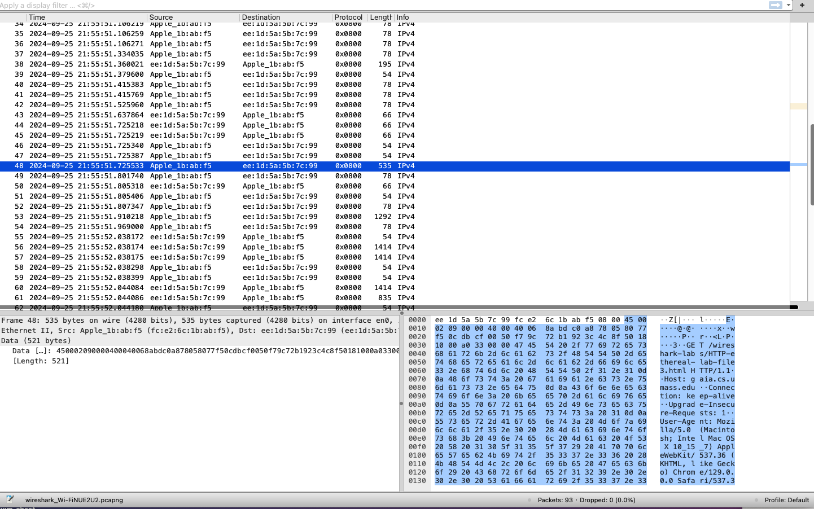
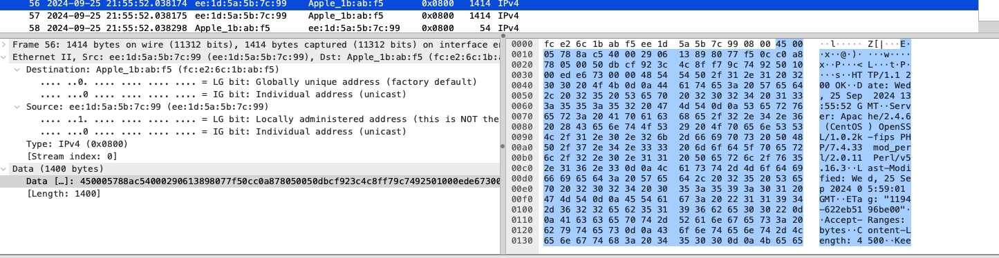
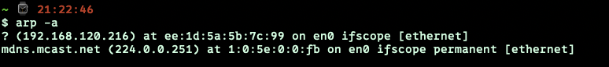

# wireshark : ARP and Ethernet
### Ethernet:
效果：

回答问题：
1.你的电脑 48 位的地址是多少
> fc:e2:6c:1b:ab:f5

2.以太网帧中的 48 位目标地址是什么?这是 gaia.cs.umass.edu 的以太网地址 吗?(提示:答案是否定的)。那么它是什么?注意这一题可能会犯错，请 阅读 468-469(中文版 305-308 页)然后理解它
> ee:1d:5a:5b:7c:99。这个应该是我们主机所在子网的交换机接口的以太网地址，因为经过不断的传输，帧中的地址将会不断改变

3.以太网帧上层协议 16 进制值是什么?这对应的上层协议是什么?
> type，指示上层网络层协议，这里是IPv4

4.从以太帧的开始，一直到“GET”中的 ASCII“G”出现在以太网帧中為止，有多少字节?
> 55byte

5.这个乙太网帧中，以太网源地址的值是多少?这是你的计算机的地址，还是gaia.cs.umass.edu 的地址(提示:答案是否定的)。拥有这个以太网地址的设备是什么?

> 源地址：ee:1d:5a:5b:7c:99，都不是，是子网中与我主机相邻的交换机的接口以太网地址.

6.以太网帧中的目的地址是什么?这是您的计算机的以太网地址吗?
> 目的地址：fc:e2:6c:1b:ab:f5，是的

7.以太网帧上层协议 16 进制值是什么?这对应的上层协议是什么?
> type,指示网络层协议，IPv4

8.从以太帧的开始，一直到“OK”中的 ASCII“O”出现在以太网帧中为止，有多少字节?
> 68byte

### ARP:

9.写下计算机 ARP 缓存的内容。每个列值的含义是什么?
 
> 不太清楚

10.包含 ARP 请求消息的以太网帧中源和目标地址的十六进制值是什么?
> 因为没有无线路由器，所以无法抓取ARP请求报文，所以这里只抓取了响应报文，实际情况是源：自己主机mac地址，目标：ff:ff:ff:ff:ff:ff

11.以太网帧上层协议 16 进制值是什么?
> 0x0806(ARP)

~~12.未能抓取请求消息，略~~

13.
- ARP 操作码字段开始从以太网帧的最开始有多少字节?
  -  21byte
- 在进行 ARP 响应的以太网帧的 ARP 负载部分中，操作码字段的值是多少?
  - 2
- 在响应 ARP 中从哪里看出现早期 ARP 请求的答案?
  - sender IP address

14.包含 ARP 回复消息的以太网帧中的源地址和目标地址的十六进制值是多 少?
> 源地址：ee:1d:5a:5b:7c:99(路由地址)，目标地址：fc:e2:6c:1b:ab:f5(本机地址)

### over...